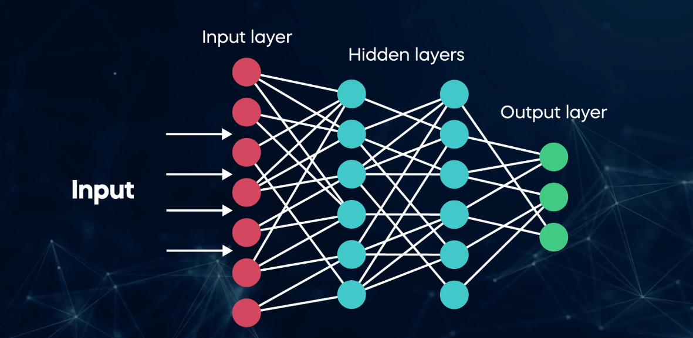
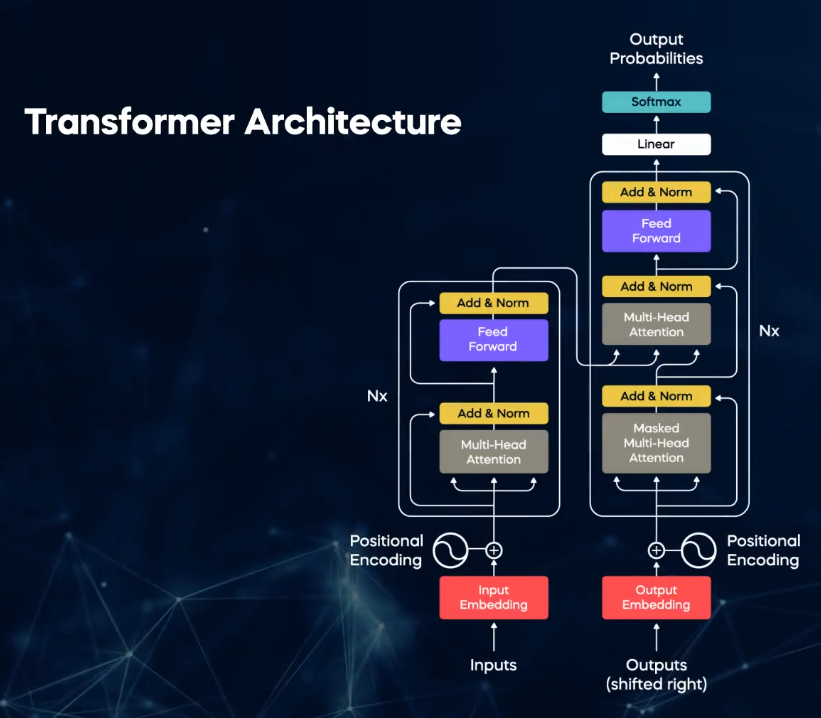

# LLM

An LLM (Large Language Model) is an AI system trained on huge amounts of text so it can understand and generate human language. ChatGPT, Gemini, and Claude are all built on LLMs.

## The core idea: predicting the next word

At its heart, an LLM does one thing: given some text, it predicts what word (or piece of a word) should come next.

If you type "The capital of France is", the model has seen enough text to know that "Paris" is the most likely next word. Now repeat that prediction over and over, feeding each new word back in, and you get whole sentences, essays, or code. It's like your phone's autocomplete, but trained on a vastly larger amount of text and far better at capturing context.

### Main features to Large Language Models which make them unique
1. The LLMs are larger compared to other models.
2. General Purpose
3. Ability to be pre-trained and fine tuned

LLMs are characterized by their size. It is measured by the number of parameters the LLM has.

**Parameters:** Tiny bits of information, that help the model understand and generate language. The more parameters a model has, the better it can understand and work with language.

The most famous LLMs contains millions, billions and trillions of parameters.

**General Purpose:**

- Model has been trained on a wide variety of text data from the internet.
- Designed to understand and generate human language in a broad and versatile manner.
- Multi-talented language tool that can assist with many different jobs.

**LLMs goal:** Give general understanding of knowledge and how language works so that it can be applied to more specfic task later on.

## Pre-training and fine tuning a LLM

**Few-shot:** where we use minimal data to train a model

**Zero-shot:** where the model can recognize things that it has not been explicitly taught in the training.

### Applications

1. Content creation
    - Write articles
    - Blog posts
    - Creative stories
2. Translation
3. Answering questions
    - Answer questions on various topics
    - Solve math problems
4. Chatbots
    - Used to create chatbots and virtual assistants
    - Can hold conversations with users
5. Sentiment Analysis
    - Analyze the sentiment in text
6. Sumarization
    - Summarize long articles or documents
7. Content Recommendations
    - Power recommendation systems.
8. Generating code
    - Generate code snippets
    - Debug
    - Explaining complex programming concepts
9. Medical Diagnosis
    - Analyzing medical records
    - Suggesting possible diagnosis
    - Staying updated with the latest medical research
10. Legal document reviews
    - help identify relevant information
11. Personalized marketing
    - create personalized marketing campaigns
    - recommending products or services

# Transformers Architecture

LLMs are based on transformer architecture

**Deep learning:** Type of model architecture that can excel at finding patterns in complex data due to its network structure.

**Neuron:** 
**Each neuron applies a mathematical operations:**
**Adjusting the strength of connections (Weights) between the neurons**

The weights are continually updated during the training phase to minimize the difference between the training output and the actual output. This is the process known as **Optimization**

Different Neural networks deal with different problems

1. Convolution Neural Networks:
    - vision classification
    - analyzing images
    - struggles to analyze language
2. Recurrent Neural Networks:
    - struggle when the input text is too long

The attention mechanism enables a model to weigh the importance of different words or tokens in a input sequence when producing an output. It lets every word look at every other word in the sentence and decide how much focus each one deserves.

**Self attention:**
Specific type of mechanism that computes relationships within a single input sequence and capture dependencies and contextual information. 

**RNN:** Each word at a time
**Transformer:** All words at once

Transformers use encoder-decoder architecture

#### Step 1: Input Embeddings

1. Break down the input text into tokens
2. Each token is then mapped to a unique identifying number based on a predefined vocabulary
3. Once tokens are mapped to their respective indices, the model retireves its pre-trained word embeddings

**Positional encoding:** We give each token a number, recording the position of the token in the sentence.

**Padding:** Adds special tokens or zeroes to the embeddings of shorter sequences.
**Truncation:** Removes tokens from the longer sequences.
